# Entity Relationship Diagram — 4N Clinic Management System

## Tổng quan

Database của hệ thống được tổ chức theo 5 domain chính:

| Domain | Models | Phase |
|---|---|---|
| Identity & Access | User, Role, Permission, UserRole, RolePermission, RefreshToken, AuditLog | Phase 1 |
| Clinical Core | Patient, Visit, Examination, Disease, Diagnosis, Drug, Prescription, PrescriptionItem | Phase 1 |
| Financial | Invoice, InvoiceItem, Payment | Phase 1 |
| Operations | RegulationVersion, RegulationItem | Phase 1 |
| Organization | Department, Room, DoctorProfile, StaffSchedule | Phase 2A |
| Scheduling | Appointment, QueueTicket | Phase 2A |
| Clinical Extension | VitalSign, ServiceCatalog, LabTestCatalog, ServiceOrder | Phase 2A |
| Laboratory | LabOrder, LabSample, LabResult | Phase 2A |
| Pharmacy & Inventory | StockLot, StockMovement, Dispense, DispenseItem | Phase 2A |

**Tổng:** 37 models (20 Phase 1 + 17 Phase 2A)

**Nguồn chốt:** `backend/prisma/schema.prisma`

---

## Cách dùng diagram với draw.io

1. Mở draw.io → tạo diagram mới
2. Menu **Extras → Edit Diagram**
3. Chọn format **Mermaid**
4. Paste nội dung từ file `.mmd` tương ứng trong `docs/software-design-workspace/final-output/04_DIAGRAM_SOURCES/`

| File | Nội dung |
|---|---|
| `ERD_01_Phase1.mmd` | 20 models Phase 1 đầy đủ |
| `ERD_02_Phase2A_Delta.mmd` | 17 models Phase 2A mới + Phase 1 anchors |
| `ERD_03_Full_Schema.mmd` | Toàn bộ 37 models |

---

## ERD Phase 1 — As-Built (20 models)

```mermaid
erDiagram

%% ─── Identity & Access ───────────────────────────────────────

    User {
        string  id          PK  "uuid"
        string  username    UK  "nullable"
        string  passwordHash    "bcrypt, never expose"
        string  fullName
        string  email           "nullable"
        string  phone           "nullable"
        string  status          "ACTIVE|INACTIVE|LOCKED"
        datetime createdAt
        datetime updatedAt
    }

    Role {
        string  id      PK  "uuid"
        string  code    UK  "nullable"
        string  name
        string  description "nullable"
        datetime createdAt
        datetime updatedAt
    }

    Permission {
        string  id      PK  "uuid"
        string  code    UK
        string  name
        string  description "nullable"
        datetime createdAt
        datetime updatedAt
    }

    UserRole {
        string  userId  PK,FK   "→ User"
        string  roleId  PK,FK   "→ Role"
        datetime createdAt
    }

    RolePermission {
        string  roleId       PK,FK  "→ Role"
        string  permissionId PK,FK  "→ Permission"
    }

    RefreshToken {
        string  id        PK  "uuid"
        string  userId    FK  "→ User"
        string  tokenHash     "SHA-256 hash"
        datetime revokedAt    "nullable"
        datetime expiresAt
        datetime createdAt
    }

    AuditLog {
        string  id         PK  "uuid"
        string  actorId    FK  "→ User (nullable)"
        string  action         "LOGIN_SUCCESS|CREATE_VISIT|..."
        string  entityType
        string  entityId       "nullable"
        json    before         "nullable"
        json    after          "nullable"
        datetime createdAt
    }

%% ─── Clinical ────────────────────────────────────────────────

    Patient {
        string  id          PK  "uuid"
        string  patientCode UK
        string  fullName
        datetime dob            "nullable"
        string  gender          "nullable"
        string  phone           "nullable"
        string  citizenId   UK  "nullable"
        string  address         "nullable"
        datetime createdAt
        datetime updatedAt
    }

    Visit {
        string  id              PK  "uuid"
        string  patientId       FK  "→ Patient"
        string  createdByUserId FK  "→ User"
        string  departmentId    FK  "→ Department (nullable)"
        string  appointmentId   FK,UK "→ Appointment (nullable)"
        date    visitDate
        int     queueNumber
        string  reason          "nullable"
        string  status          "REGISTERED|WAITING|IN_EXAMINATION|COMPLETED|CANCELLED"
        datetime createdAt
        datetime updatedAt
    }

    Examination {
        string  id           PK  "uuid"
        string  visitId      FK,UK "→ Visit (1:1)"
        string  doctorUserId FK  "→ User"
        string  symptoms         "nullable"
        string  clinicalNotes    "nullable"
        string  conclusion       "nullable"
        string  status           "OPEN|COMPLETED|CANCELLED"
        datetime completedAt     "nullable"
        datetime createdAt
        datetime updatedAt
    }

    Disease {
        string  id       PK  "uuid"
        string  code     UK
        string  name
        boolean isActive
        datetime createdAt
        datetime updatedAt
    }

    Diagnosis {
        string  id            PK  "uuid"
        string  examinationId FK  "→ Examination"
        string  diseaseId     FK  "→ Disease (nullable)"
        string  name
        boolean isPrimary
        datetime createdAt
    }

    Drug {
        string  id       PK  "uuid"
        string  name     UK
        string  unit
        decimal price
        boolean isActive
        datetime createdAt
        datetime updatedAt
    }

    Prescription {
        string  id            PK  "uuid"
        string  examinationId FK,UK "→ Examination (1:1)"
        string  note              "nullable"
        datetime createdAt
        datetime updatedAt
    }

    PrescriptionItem {
        string  id             PK     "uuid"
        string  prescriptionId FK     "→ Prescription"
        string  drugId         FK     "→ Drug"
        int     quantity
        string  dosage
        decimal unitPrice          "snapshot at prescription time"
        decimal lineTotal
        datetime createdAt
    }

%% ─── Financial ───────────────────────────────────────────────

    Invoice {
        string  id          PK  "uuid"
        string  visitId     FK,UK "→ Visit (1:1)"
        decimal totalAmount
        decimal paidAmount
        string  status      "DRAFT|ISSUED|PARTIALLY_PAID|PAID|VOID"
        datetime createdAt
        datetime updatedAt
    }

    InvoiceItem {
        string  id            PK  "uuid"
        string  invoiceId     FK  "→ Invoice"
        string  description       "snapshot"
        int     quantity
        decimal unitPrice         "snapshot"
        decimal lineTotal
        string  itemType          "nullable: CONSULTATION|LAB_TEST|MEDICINE|..."
        string  referenceType     "nullable: SERVICE_ORDER|DISPENSE_ITEM|EXAM_FEE"
        string  referenceId       "nullable"
        datetime createdAt
    }

    Payment {
        string  id        PK  "uuid"
        string  invoiceId FK  "→ Invoice"
        decimal amount
        string  method    "CASH|TRANSFER|CARD"
        string  note      "nullable"
        datetime paidAt
        datetime createdAt
    }

%% ─── Operations ──────────────────────────────────────────────

    RegulationVersion {
        string  id          PK  "uuid"
        boolean isActive
        datetime activatedAt "nullable"
        string  note         "nullable"
        datetime createdAt
    }

    RegulationItem {
        string  id        PK  "uuid"
        string  versionId FK  "→ RegulationVersion"
        string  key           "e.g. MAX_PATIENTS_PER_DAY"
        string  value
    }

%% ─── Relationships ───────────────────────────────────────────

    User            ||--o{    UserRole        : "assigned"
    Role            ||--o{    UserRole        : "assigned to"
    Role            ||--o{    RolePermission  : "grants"
    Permission      ||--o{    RolePermission  : "granted by"
    User            ||--o{    RefreshToken    : "owns"
    User            |o--o{    AuditLog        : "performed"

    Patient         ||--o{    Visit           : "has"
    User            ||--o{    Visit           : "created by"
    Visit           ||--o|    Examination     : "has"
    Visit           ||--o|    Invoice         : "billed as"

    User            ||--o{    Examination     : "performed by doctor"
    Examination     ||--o{    Diagnosis       : "contains"
    Examination     ||--o|    Prescription    : "has"
    Disease         |o--o{    Diagnosis       : "classified as"

    Prescription    ||--o{    PrescriptionItem : "contains"
    Drug            ||--o{    PrescriptionItem : "prescribed"

    Invoice         ||--o{    InvoiceItem     : "contains"
    Invoice         ||--o{    Payment         : "paid via"

    RegulationVersion ||--o{  RegulationItem  : "contains"
```



---

## ERD Phase 2A — Delta (17 models mới)

> Phase 1 anchors được giữ lại ở dạng tối giản để hiển thị liên kết.

```mermaid
erDiagram

%% ─── Phase 1 Anchors ─────────────────────────────────────────

    User { string id PK }
    Patient { string id PK }

    Visit {
        string  id            PK
        string  departmentId  FK  "→ Department"
        string  appointmentId FK  "→ Appointment (nullable)"
    }

    Examination { string id PK }
    Prescription { string id PK }

    PrescriptionItem {
        string  id             PK
        string  prescriptionId FK
        string  drugId         FK
        int     quantity
        decimal unitPrice
    }

    Drug { string id PK }
    Invoice { string id PK }

%% ─── Organization (NEW) ──────────────────────────────────────

    Department {
        string  id          PK  "uuid"
        string  code        UK
        string  name
        string  description "nullable"
        boolean isActive
        datetime createdAt
        datetime updatedAt
    }

    Room {
        string  id           PK  "uuid"
        string  departmentId FK  "→ Department"
        string  code             "unique per dept"
        string  name
        string  roomType         "CONSULTATION|LAB|PHARMACY|PROCEDURE"
        boolean isActive
        datetime createdAt
        datetime updatedAt
    }

    DoctorProfile {
        string  id           PK  "uuid"
        string  userId       FK,UK "→ User (1:1)"
        string  departmentId FK  "→ Department"
        string  title            "nullable"
        string  specialty        "nullable"
        boolean isActive
        datetime createdAt
        datetime updatedAt
    }

    StaffSchedule {
        string  id                  PK  "uuid"
        string  userId              FK  "→ User"
        string  departmentId        FK  "→ Department"
        string  roomId              FK  "→ Room (nullable)"
        date    workDate
        string  startTime
        string  endTime
        int     slotDurationMinutes
        int     maxAppointments
        string  status              "ACTIVE|INACTIVE"
        datetime createdAt
        datetime updatedAt
    }

%% ─── Scheduling (NEW) ────────────────────────────────────────

    Appointment {
        string  id              PK  "uuid"
        string  patientId       FK  "→ Patient"
        string  doctorProfileId FK  "→ DoctorProfile"
        string  departmentId    FK  "→ Department"
        string  roomId          FK  "→ Room (nullable)"
        string  scheduleId      FK  "→ StaffSchedule (nullable)"
        string  createdById     FK  "→ User"
        datetime scheduledAt
        int     durationMinutes
        string  status          "SCHEDULED|CHECKED_IN|CANCELLED|NO_SHOW"
        string  reason          "nullable"
        datetime createdAt
        datetime updatedAt
    }

    QueueTicket {
        string  id           PK  "uuid"
        string  visitId      FK,UK "→ Visit (1:1)"
        string  departmentId FK  "→ Department"
        date    queueDate
        int     queueNumber      "unique per dept+date"
        int     priority         "0=walk-in, 1=appointment"
        string  status       "WAITING|CALLED|IN_SERVICE|DONE|SKIPPED|CANCELLED"
        datetime calledAt    "nullable"
        datetime completedAt "nullable"
        datetime createdAt
        datetime updatedAt
    }

%% ─── Clinical Extension (NEW) ────────────────────────────────

    VitalSign {
        string  id           PK  "uuid"
        string  visitId      FK,UK "→ Visit (1:1)"
        string  measuredById FK  "→ User"
        int     pulse            "nullable bpm"
        int     systolicBp       "nullable mmHg"
        int     diastolicBp      "nullable mmHg"
        decimal temperature      "nullable °C"
        int     spo2             "nullable %"
        decimal heightCm         "nullable cm"
        decimal weightKg         "nullable kg"
        decimal bmi              "nullable, auto-computed"
        string  note             "nullable"
        datetime measuredAt
        datetime createdAt
        datetime updatedAt
    }

    ServiceCatalog {
        string  id       PK  "uuid"
        string  code     UK
        string  name
        string  type     "CONSULTATION|LAB_TEST|PROCEDURE|IMAGING|MATERIAL"
        decimal price
        boolean isActive
        datetime createdAt
        datetime updatedAt
    }

    LabTestCatalog {
        string  id              PK  "uuid"
        string  serviceId       FK,UK "→ ServiceCatalog (1:1)"
        string  code            UK
        string  sampleType      "BLOOD|URINE|STOOL|..."
        int     turnaroundHours
        string  referenceRange  "nullable"
    }

    ServiceOrder {
        string  id            PK  "uuid"
        string  visitId       FK  "→ Visit"
        string  examinationId FK  "→ Examination (nullable)"
        string  serviceId     FK  "→ ServiceCatalog"
        string  orderedById   FK  "→ User"
        string  status        "ORDERED|IN_PROGRESS|COMPLETED|CANCELLED"
        boolean isRequired
        decimal priceSnapshot     "snapshot at order time"
        string  billingStatus "PENDING|BILLED"
        datetime orderedAt
        datetime createdAt
        datetime updatedAt
    }

%% ─── Laboratory (NEW) ────────────────────────────────────────

    LabOrder {
        string  id             PK  "uuid"
        string  serviceOrderId FK,UK "→ ServiceOrder (1:1)"
        string  labTestId      FK  "→ LabTestCatalog"
        string  status         "ORDERED|SAMPLE_COLLECTED|RESULT_ENTERED|VERIFIED|CANCELLED"
        datetime createdAt
        datetime updatedAt
    }

    LabSample {
        string  id            PK  "uuid"
        string  labOrderId    FK  "→ LabOrder"
        string  collectedById FK  "→ User"
        string  sampleType
        string  status        "COLLECTED"
        datetime collectedAt
        string  note          "nullable"
        datetime createdAt
    }

    LabResult {
        string  id             PK  "uuid"
        string  labOrderId     FK  "→ LabOrder"
        string  enteredById    FK  "→ User"
        string  verifiedById   FK  "→ User (nullable)"
        string  resultText         "nullable"
        decimal resultValue        "nullable"
        string  unit               "nullable"
        string  referenceRange     "nullable"
        string  status
        datetime enteredAt
        datetime verifiedAt        "nullable"
        datetime createdAt
        datetime updatedAt
    }

%% ─── Pharmacy & Inventory (NEW) ─────────────────────────────

    StockLot {
        string  id             PK  "uuid"
        string  drugId         FK  "→ Drug"
        string  lotNumber          "unique per drug"
        date    expiryDate         "FEFO sort key"
        int     quantityOnHand     "decremented on dispense"
        decimal unitCost           "nullable"
        datetime receivedAt
        datetime createdAt
        datetime updatedAt
    }

    StockMovement {
        string  id            PK  "uuid"
        string  drugId        FK  "→ Drug"
        string  lotId         FK  "→ StockLot"
        string  createdById   FK  "→ User"
        string  movementType  "IN|OUT|ADJUSTMENT"
        int     quantity
        string  referenceType "nullable"
        string  referenceId   "nullable"
        string  note          "nullable"
        datetime createdAt
    }

    Dispense {
        string  id             PK  "uuid"
        string  prescriptionId FK,UK "→ Prescription (1:1)"
        string  visitId        FK  "→ Visit"
        string  dispensedById  FK  "→ User"
        string  status         "PENDING|DISPENSED|CANCELLED"
        datetime dispensedAt   "nullable"
        string  note           "nullable"
        datetime createdAt
        datetime updatedAt
    }

    DispenseItem {
        string  id                 PK  "uuid"
        string  dispenseId         FK  "→ Dispense"
        string  prescriptionItemId FK,UK "→ PrescriptionItem (1:1)"
        string  drugId             FK  "→ Drug"
        string  lotId              FK  "→ StockLot (FEFO)"
        int     quantity
        decimal unitPriceSnapshot      "snapshot at dispense time"
        datetime createdAt
    }

%% ─── Relationships ───────────────────────────────────────────

    Department      ||--o{    Room            : "contains"
    Department      ||--o{    DoctorProfile   : "has"
    Department      ||--o{    StaffSchedule   : "schedules"
    Room            ||--o{    StaffSchedule   : "used in"
    User            ||--o|    DoctorProfile   : "profile"
    DoctorProfile   ||--o{    StaffSchedule   : "works in"

    Patient         ||--o{    Appointment     : "books"
    DoctorProfile   ||--o{    Appointment     : "receives"
    Department      ||--o{    Appointment     : "for"
    Room            |o--o{    Appointment     : "in (nullable)"
    StaffSchedule   |o--o{    Appointment     : "on slot (nullable)"
    User            ||--o{    Appointment     : "created by"
    Appointment     ||--o|    Visit           : "creates (check-in)"

    Visit           ||--o|    QueueTicket     : "has"
    Department      ||--o{    QueueTicket     : "in"

    Visit           ||--o|    VitalSign       : "has"
    User            ||--o{    VitalSign       : "measured by"
    Visit           ||--o{    ServiceOrder    : "has"
    Examination     |o--o{    ServiceOrder    : "ordered from"
    ServiceCatalog  ||--o{    ServiceOrder    : "catalog"
    ServiceCatalog  ||--o|    LabTestCatalog  : "lab detail"
    User            ||--o{    ServiceOrder    : "ordered by"

    ServiceOrder    ||--o|    LabOrder        : "creates"
    LabTestCatalog  ||--o{    LabOrder        : "for test"
    LabOrder        ||--o{    LabSample       : "has"
    LabOrder        ||--o{    LabResult       : "has"
    User            ||--o{    LabSample       : "collected by"
    User            ||--o{    LabResult       : "entered by"
    User            |o--o{    LabResult       : "verified by (nullable)"

    Drug            ||--o{    StockLot        : "stored in lots"
    StockLot        ||--o{    StockMovement   : "tracks IN/OUT"
    Drug            ||--o{    StockMovement   : "moved"
    User            ||--o{    StockMovement   : "created by"
    Prescription    ||--o|    Dispense        : "dispensed as"
    Visit           ||--o{    Dispense        : "for"
    User            ||--o{    Dispense        : "dispensed by"
    Dispense        ||--o{    DispenseItem    : "contains"
    PrescriptionItem ||--o|   DispenseItem    : "fulfilled by"
    Drug            ||--o{    DispenseItem    : "of drug"
    StockLot        ||--o{    DispenseItem    : "from lot (FEFO)"
```



---

## Mô tả chi tiết các nhóm model

### 1. Identity & Access

| Model | Mô tả |
|---|---|
| **User** | Tài khoản nhân viên. Có thể mang nhiều Role. `passwordHash` dùng bcrypt, không bao giờ expose ra API. |
| **Role** | Vai trò trong hệ thống: ADMIN, RECEPTIONIST, DOCTOR, CASHIER, MANAGER. |
| **Permission** | Quyền hạt nhỏ (fine-grained), được gán vào Role. |
| **UserRole** | Bảng nối many-to-many User ↔ Role. |
| **RolePermission** | Bảng nối many-to-many Role ↔ Permission. |
| **RefreshToken** | Lưu hash của refresh token. `revokedAt` null = còn hiệu lực. |
| **AuditLog** | Ghi lại mọi hành động quan trọng. `actorId` nullable khi system action. |

### 2. Clinical Core

| Model | Mô tả |
|---|---|
| **Patient** | Hồ sơ bệnh nhân. `patientCode` unique (auto-generated). `citizenId` nullable vì không phải ai cũng có CCCD. |
| **Visit** | Một lượt khám trong ngày. `(patientId, visitDate)` unique — mỗi bệnh nhân chỉ 1 lượt/ngày. `queueNumber` auto-increment trong ngày. |
| **Examination** | Phiếu khám bệnh (1:1 với Visit). Bác sĩ mở, điền triệu chứng, kết luận, rồi hoàn tất. |
| **Disease** | Danh mục bệnh (ICD-style). `isActive` để vô hiệu hóa mà không xóa. |
| **Diagnosis** | Kết quả chẩn đoán trong một Examination. `isPrimary` đánh dấu chẩn đoán chính. |
| **Drug** | Danh mục thuốc. `price` là giá hiện tại, snapshot khi kê đơn. |
| **Prescription** | Đơn thuốc (1:1 với Examination). |
| **PrescriptionItem** | Chi tiết từng loại thuốc trong đơn. `unitPrice` là snapshot tại thời điểm kê đơn. |

### 3. Financial

| Model | Mô tả |
|---|---|
| **Invoice** | Hóa đơn (1:1 với Visit). `paidAmount` được cộng dồn từng lần thanh toán. |
| **InvoiceItem** | Dòng chi tiết hóa đơn. `description`, `unitPrice` là snapshot để bảo toàn lịch sử. |
| **Payment** | Một lần thanh toán. Hỗ trợ CASH, TRANSFER, CARD. Có thể có nhiều Payment cho một Invoice. |

### 4. Operations

| Model | Mô tả |
|---|---|
| **RegulationVersion** | Phiên bản quy định phòng mạch. Chỉ 1 phiên bản được `isActive = true` tại một thời điểm. |
| **RegulationItem** | Từng cấu hình trong phiên bản quy định (key-value). Key quan trọng: `MAX_PATIENTS_PER_DAY`, `CONSULTATION_FEE`. |

### 5. Organization (Phase 2A)

| Model | Mô tả |
|---|---|
| **Department** | Khoa/phòng trong phòng mạch. |
| **Room** | Phòng vật lý thuộc một Department. `roomType`: CONSULTATION, LAB, PHARMACY, PROCEDURE. |
| **DoctorProfile** | Hồ sơ bác sĩ (1:1 với User). Gắn với Department và chuyên khoa. |
| **StaffSchedule** | Lịch làm việc của nhân viên/bác sĩ theo ngày và phòng. |

### 6. Scheduling (Phase 2A)

| Model | Mô tả |
|---|---|
| **Appointment** | Lịch hẹn đặt trước. Khi check-in sẽ tạo Visit tương ứng. |
| **QueueTicket** | Vé xếp hàng trong ngày. `priority = 1` cho bệnh nhân có hẹn trước. |

### 7. Clinical Extension (Phase 2A)

| Model | Mô tả |
|---|---|
| **VitalSign** | Chỉ số sinh hiệu đo trước khám (1:1 với Visit): mạch, huyết áp, nhiệt độ, SpO2, BMI. |
| **ServiceCatalog** | Danh mục dịch vụ: xét nghiệm, thủ thuật, chẩn đoán hình ảnh,... |
| **LabTestCatalog** | Thông tin chi tiết xét nghiệm (1:1 với ServiceCatalog loại LAB_TEST). |
| **ServiceOrder** | Chỉ định dịch vụ cho một lượt khám. |

### 8. Laboratory (Phase 2A)

| Model | Mô tả |
|---|---|
| **LabOrder** | Lệnh xét nghiệm (1:1 với ServiceOrder loại LAB_TEST). |
| **LabSample** | Mẫu bệnh phẩm thu thập cho một LabOrder. |
| **LabResult** | Kết quả xét nghiệm. Cần được verify trước khi bác sĩ đọc kết quả chính thức. |

### 9. Pharmacy & Inventory (Phase 2A)

| Model | Mô tả |
|---|---|
| **StockLot** | Lô thuốc nhập kho. `expiryDate` dùng cho thuật toán FEFO (First Expired, First Out). |
| **StockMovement** | Giao dịch tồn kho: nhập (IN), xuất (OUT), điều chỉnh (ADJUSTMENT). |
| **Dispense** | Phát thuốc theo đơn (1:1 với Prescription). |
| **DispenseItem** | Chi tiết từng thuốc được phát, gắn với lô cụ thể theo FEFO. |

---

## Các ràng buộc quan trọng

### Unique constraints

| Constraint | Bảng | Ý nghĩa |
|---|---|---|
| `(patientId, visitDate)` | Visit | Mỗi bệnh nhân chỉ 1 lượt khám/ngày |
| `(visitDate, queueNumber)` | Visit | Số thứ tự không trùng trong ngày |
| `visitId` | Examination | 1 Visit chỉ có 1 Examination |
| `visitId` | Invoice | 1 Visit chỉ có 1 Invoice |
| `examinationId` | Prescription | 1 Examination chỉ có 1 Prescription |
| `(prescriptionId, drugId)` | PrescriptionItem | Không kê trùng thuốc trong đơn |
| `(departmentId, queueDate, queueNumber)` | QueueTicket | Số thứ tự unique per khoa/ngày |
| `(drugId, lotNumber)` | StockLot | Không trùng lô thuốc |
| `prescriptionItemId` | DispenseItem | 1 dòng đơn thuốc chỉ phát 1 lần |

### Business rules qua schema

| Rule | Cách enforce |
|---|---|
| Chỉ 1 regulation active | `isActive` boolean trên RegulationVersion, application-level check khi activate |
| Snapshot giá thuốc | `unitPrice` trong PrescriptionItem lưu giá tại thời điểm kê, không dùng Drug.price |
| FEFO khi phát thuốc | Sort StockLot theo `expiryDate ASC` khi chọn lô |
| Không overpay | `paidAmount <= totalAmount` enforce ở service layer |
| Visit daily cap | Đọc `MAX_PATIENTS_PER_DAY` từ RegulationVersion active |

---

## Enums

| Enum | Values |
|---|---|
| `UserStatus` | ACTIVE, INACTIVE, LOCKED |
| `VisitStatus` | REGISTERED, WAITING, IN_EXAMINATION, COMPLETED, CANCELLED |
| `ExaminationStatus` | OPEN, COMPLETED, CANCELLED |
| `InvoiceStatus` | DRAFT, ISSUED, PARTIALLY_PAID, PAID, VOID |
| `PaymentMethod` | CASH, TRANSFER, CARD |
| `AppointmentStatus` | SCHEDULED, CHECKED_IN, CANCELLED, NO_SHOW |
| `QueueStatus` | WAITING, CALLED, IN_SERVICE, DONE, SKIPPED, CANCELLED |
| `ServiceType` | CONSULTATION, LAB_TEST, PROCEDURE, IMAGING, MATERIAL |
| `ServiceOrderStatus` | ORDERED, IN_PROGRESS, COMPLETED, CANCELLED |
| `LabOrderStatus` | ORDERED, SAMPLE_COLLECTED, RESULT_ENTERED, VERIFIED, CANCELLED |
| `DispenseStatus` | PENDING, DISPENSED, CANCELLED |
| `StockMovementType` | IN, OUT, ADJUSTMENT |

---

## Luồng nghiệp vụ chính qua ERD

### Luồng khám bệnh Phase 1

```
Patient → Visit → Examination → Diagnosis (Disease)
                             → Prescription → PrescriptionItem (Drug)
        → Invoice → InvoiceItem
                 → Payment
```

### Luồng Phase 2A mở rộng

```
Appointment → Visit → QueueTicket (Department)
                    → VitalSign
                    → ServiceOrder (ServiceCatalog)
                              → LabOrder (LabTestCatalog)
                                       → LabSample
                                       → LabResult
                    → Examination → Prescription → Dispense
                                                         → DispenseItem (StockLot)
                                                                  → StockMovement
```
