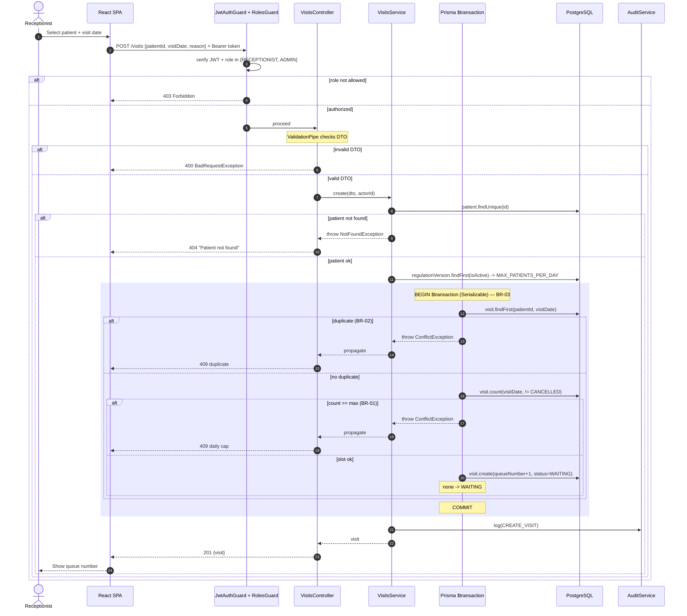
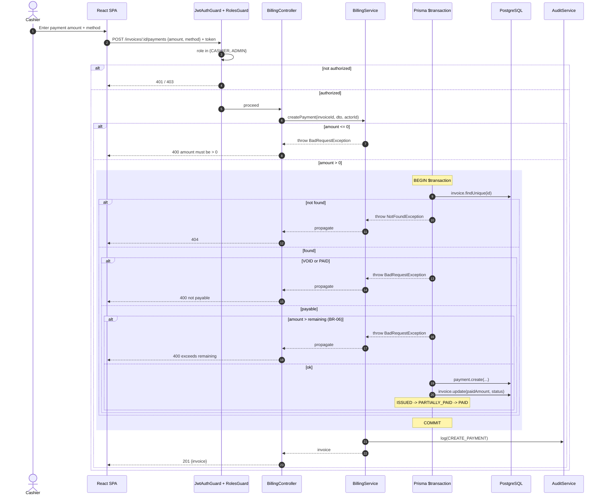
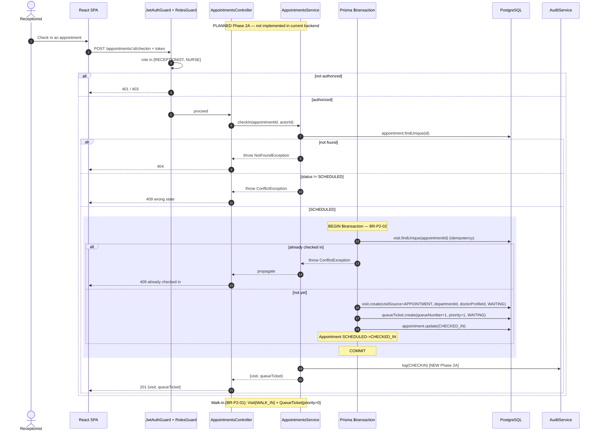
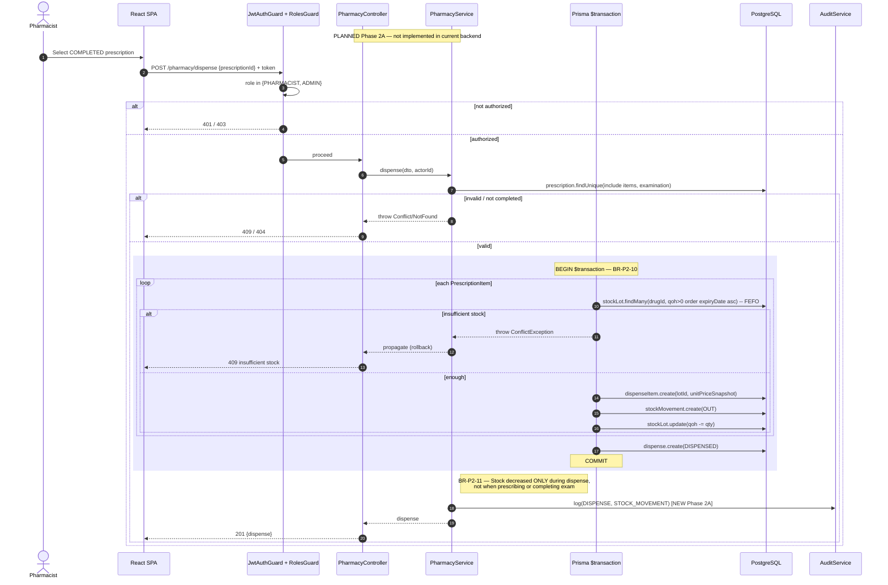

# Thiết kế xử lý & Sequence Diagram
## 4N Clinic Management System — SE104
**Phiên bản:** 1.0 · **Ngày:** 2026-06-04 · **Phạm vi:** Phase 1 (As-Built) + Phase 2A (Planned)

> Tài liệu chỉ thuộc bước **Design** (không sửa code/schema/migration). Diagram As-Built đối chiếu trực tiếp
> `backend/src/modules/**`; diagram Planned dựa trên `MODE_C_CONTEXT.md`. Quy ước vẽ theo
> [`SEQUENCE_DIAGRAM_RULES.md`](../software-design-workspace/final-output/04_DIAGRAM_SOURCES/SEQUENCE_DIAGRAM_RULES.md).
>
> ⚠️ **Ảnh PNG/SVG chưa render được** trong môi trường tạo tài liệu (mermaid-cli cần headless browser, sandbox
> chặn — chi tiết ở [VALIDATION_REPORT.md](VALIDATION_REPORT.md) §2). Báo cáo này **nhúng mã Mermaid** để xem
> trực tiếp trên GitHub/VS Code; khi cần ảnh, render thủ công qua https://mermaid.live.
>
> 📐 **Hai bản cho mỗi diagram:**
> - `SEQ_*.mmd` — **FULL** (đầy đủ kỹ thuật, dùng review/đối chiếu code).
> - `SEQ_*_A4_REPORT.mmd` — **A4** (rút gọn label, alias ngắn, nền trắng + init theme, chèn DOCX A4 landscape).
>   Logic nghiệp vụ + happy path + nhánh lỗi chính giữ nguyên; chỉ rút gọn chữ. Diagram Lab (P2-03) tách
>   `PART1` (order→collect→result) và `PART2` (review) để vừa A4. **Chèn vào DOCX nên dùng bản A4.**

---

## Mục lục

1. [Giới thiệu](#1-giới-thiệu)
2. [Quy ước đọc sequence diagram](#2-quy-ước-đọc-sequence-diagram)
3. [Rule baseline dùng trong dự án](#3-rule-baseline-dùng-trong-dự-án)
4. [Kiến trúc participant chuẩn](#4-kiến-trúc-participant-chuẩn)
5. [UC Rule Matrix](#5-uc-rule-matrix)
6. [Sequence Diagram — Phase 1 (As-Built)](#6-sequence-diagram--phase-1-as-built)
7. [Sequence Diagram — Phase 2A (Planned)](#7-sequence-diagram--phase-2a-planned)
8. [Bảng traceability](#8-bảng-traceability)
9. [Nhận xét As-Built vs Planned](#9-nhận-xét-as-built-vs-planned)
10. [Hạn chế & khuyến nghị hardening](#10-hạn-chế--khuyến-nghị-hardening)
11. [Phụ lục: danh sách Mermaid source](#11-phụ-lục-danh-sách-mermaid-source)

---

## 1. Giới thiệu

Thiết kế xử lý mô tả hệ thống tiếp nhận, biến đổi và lưu dữ liệu theo trình tự thời gian, với các đối tượng
tham gia rõ ràng. Sequence diagram là biểu diễn trực quan của thiết kế xử lý: nó cho thấy actor → giao diện →
controller → service → database tương tác ra sao trong một kịch bản UC, gồm cả nhánh lỗi.

Tài liệu gồm **15 diagram**: 10 cho Phase 1 (đối chiếu code thật — As-Built) và 5 cho Phase 2A (thiết kế —
Planned). Mỗi diagram bám một UC/kịch bản, có happy path và các nhánh lỗi nghiệp vụ chính.

---

## 2. Quy ước đọc sequence diagram

| Ký hiệu | Ý nghĩa |
|---|---|
| `A->>B` | Lời gọi đồng bộ (request) |
| `B-->>A` | Trả về (response / throw) |
| `alt / else` | Rẽ nhánh loại trừ (mỗi lỗi nghiệp vụ là một nhánh) |
| `opt` | Bước tùy chọn (có thể có/không) |
| `loop` | Lặp trên danh sách (items, FEFO lots) |
| `rect` + `note BEGIN/COMMIT` | Vùng chạy trong `$transaction` |
| `note over/right of` | Ghi chú: snapshot, chuyển trạng thái, mã BR, race-condition |

**Mã HTTP:** 400 (DTO/business sai), 401 (chưa xác thực), 403 (sai quyền), 404 (không tồn tại), 409 (xung đột nghiệp vụ).

---

## 3. Rule baseline dùng trong dự án

Tóm tắt các luật cứng (đầy đủ ở `SEQUENCE_DIAGRAM_RULES.md`):

1. **Một diagram = một UC.** Diagram overview không thay thế diagram chi tiết.
2. **Phân tầng lỗi:** 400 (DTO) ở Controller/ValidationPipe; 404/409/400-business ở Service/Transaction.
3. **Exception propagate đúng tầng:** `TX/DB → SV → CT → FE`, không nhảy tắt.
4. **Transaction:** validation đọc-trước (không đổi dữ liệu) đặt ngoài `$transaction`; race-check đặt trong; audit sau COMMIT.
5. **Audit** chỉ vẽ cho UC thực sự log (Phase 1 có 8 action).
6. **Snapshot** bắt buộc ghi note cho dữ liệu lịch sử.
7. **Phase 2A** luôn có note `PLANNED — not implemented`, dùng tên canonical sau CF-001..009.

---

## 4. Kiến trúc participant chuẩn

```
Actor (role) → React SPA (FE) → JwtAuthGuard + RolesGuard (GD)
            → XxxController (CT) → XxxService (SV)
            → Prisma $transaction (TX) → PostgreSQL (DB)
            → AuditService (AU, sau commit)
```

- **CT** chỉ delegate, không chứa business logic.
- **GD** chỉ xác thực JWT + kiểm role (bỏ qua với `/auth/login`, `/auth/refresh`).
- **SV** chứa toàn bộ business rule (BR-*).

---

## 5. UC Rule Matrix

Bảng đầy đủ 13 mục/UC nằm ở [TRACEABILITY_MATRIX.md §2 (Phase 1)](TRACEABILITY_MATRIX.md) và §3 (Phase 2A).
Tóm tắt:

| UC | Diagram | Actor | Transaction | Audit | Trust |
|---|---|---|---|---|---|
| UC01 Login | SEQ_P1_08 | All (public) | ❌ | LOGIN_SUCCESS/FAILED | AS-BUILT |
| UC07 Tạo lượt khám | SEQ_P1_01 | RECEPTIONIST/ADMIN | ✅ Serializable | CREATE_VISIT | AS-BUILT |
| UC09 Mở lượt khám | SEQ_P1_02 | DOCTOR/ADMIN | ✅ | OPEN_EXAMINATION | AS-BUILT |
| UC10 Lập phiếu khám | SEQ_P1_03 | DOCTOR/ADMIN | ✅ | — | AS-BUILT |
| UC12 Kê đơn | SEQ_P1_04 | DOCTOR/ADMIN | ✅ | — | AS-BUILT |
| UC13 Hoàn tất khám | SEQ_P1_05 | DOCTOR/ADMIN | ✅ | COMPLETE_EXAMINATION | AS-BUILT |
| UC14 Lập hóa đơn | SEQ_P1_06 | CASHIER/ADMIN | ❌ nested | CREATE_INVOICE | AS-BUILT |
| UC15 Thanh toán | SEQ_P1_07 | CASHIER/ADMIN | ✅ | CREATE_PAYMENT | AS-BUILT |
| UC17 Kích hoạt quy định | SEQ_P1_09 | ADMIN | ✅ | — (recommend) | AS-BUILT |
| Check-in/Queue | SEQ_P2_01 | RECEPTIONIST/NURSE | ✅ | CHECKIN* | PLANNED |
| Dispense FEFO | SEQ_P2_02 | PHARMACIST/ADMIN | ✅ | DISPENSE* | PLANNED |
| Lab order→review | SEQ_P2_03 | DOCTOR/LAB_TECHNICIAN | ✅ | LAB_RESULT_ENTERED* | PLANNED |
| Dispense reversal | SEQ_P2_04 | PHARMACIST/ADMIN | ✅ | STOCK_MOVEMENT* | PLANNED |
| Multi-source invoice | SEQ_P2_05 | CASHIER/ADMIN | ✅ | CREATE_INVOICE | PLANNED |

---

## 6. Sequence Diagram — Phase 1 (As-Built)

> Mỗi diagram dưới đây đối chiếu trực tiếp service tương ứng. File nguồn: `04_DIAGRAM_SOURCES/SEQ_P1_*.mmd`.

### 6.1 SEQ-P1-01 — Tạo lượt khám (UC07)
*Phí khám lấy từ RegulationVersion; số thứ tự sinh atomic trong transaction Serializable.*



### 6.2 SEQ-P1-02 — Mở lượt khám (UC09)
*Kiểm tra bác sĩ ACTIVE ngoài transaction; chỉ mở khi Visit đang WAITING; 1 Examination/Visit.*
→ Xem [SEQ_P1_02_OpenExamination.mmd](../software-design-workspace/final-output/04_DIAGRAM_SOURCES/SEQ_P1_02_OpenExamination.mmd)

### 6.3 SEQ-P1-03 — Lập/cập nhật phiếu khám (UC10)
*Chỉ sửa khi exam OPEN; tối đa 1 primary diagnosis; disease phải active; snapshot tên bệnh.*
→ Xem [SEQ_P1_03_UpdateExamination.mmd](../software-design-workspace/final-output/04_DIAGRAM_SOURCES/SEQ_P1_03_UpdateExamination.mmd)

### 6.4 SEQ-P1-04 — Kê đơn thuốc (UC12)
*Replace-all (BR-08); snapshot đơn giá thuốc; ≥1 dòng thuốc.*
→ Xem [SEQ_P1_04_UpsertPrescription.mmd](../software-design-workspace/final-output/04_DIAGRAM_SOURCES/SEQ_P1_04_UpsertPrescription.mmd)

### 6.5 SEQ-P1-05 — Hoàn tất phiếu khám (UC13)
*Validation INSIDE transaction; cần symptoms + conclusion + PRIMARY diagnosis; cập nhật cả Visit.*

```mermaid
sequenceDiagram
    autonumber
    actor DR as Doctor
    participant FE as React SPA
    participant GD as JwtAuthGuard + RolesGuard
    participant CT as ExaminationsController
    participant SV as ExaminationsService
    participant TX as Prisma $transaction
    participant DB as PostgreSQL
    participant AU as AuditService
    DR->>FE: Click "Complete examination"
    FE->>GD: POST /examinations/:id/complete + token
    GD->>GD: verify JWT + role in {DOCTOR, ADMIN}
    alt not authorized
        GD-->>FE: 401 / 403
    else authorized
        GD->>CT: proceed
        CT->>SV: complete(id, actorId)
        rect rgb(235,235,255)
            note over TX: BEGIN $transaction (validation inside)
            TX->>DB: examination.findUnique(id, include diagnoses)
            alt not found
                TX-->>SV: throw NotFoundException
                SV-->>CT: propagate
                CT-->>FE: 404
            else found
                alt already COMPLETED
                    TX-->>SV: return existing (idempotent)
                else CANCELLED
                    TX-->>SV: throw BadRequestException
                    SV-->>CT: propagate
                    CT-->>FE: 400 cancelled
                else OPEN
                    alt missing symptoms/conclusion
                        TX-->>SV: throw BadRequestException
                        SV-->>CT: propagate
                        CT-->>FE: 400 fields required
                    else has fields
                        alt no primary diagnosis
                            TX-->>SV: throw BadRequestException
                            SV-->>CT: propagate
                            CT-->>FE: 400 primary required
                        else ok
                            TX->>DB: examination.update(COMPLETED, completedAt)
                            TX->>DB: visit.update(COMPLETED)
                            note over TX: Exam OPEN->COMPLETED; Visit IN_EXAMINATION->COMPLETED
                        end
                    end
                end
            end
            note over TX: COMMIT
        end
        SV->>AU: log(COMPLETE_EXAMINATION)
        SV-->>CT: examination
        CT-->>FE: 201 {examination}
    end
```

### 6.6 SEQ-P1-06 — Lập hóa đơn (UC14)
*BR-04 chỉ từ visit COMPLETED; BR-05 trùng → trả existing (idempotent); tạo thẳng ISSUED; snapshot giá.*
→ Xem [SEQ_P1_06_CreateInvoice.mmd](../software-design-workspace/final-output/04_DIAGRAM_SOURCES/SEQ_P1_06_CreateInvoice.mmd)

### 6.7 SEQ-P1-07 — Ghi nhận thanh toán (UC15)
*BR-06 amount ≤ remaining (vượt → 400); cập nhật PARTIALLY_PAID / PAID.*



### 6.8 SEQ-P1-08 — Đăng nhập (UC01)
*PUBLIC (no guard); key theo username; LOCKED/INACTIVE → 403; mọi fail đều log LOGIN_FAILED; 401 không lộ account.*

```mermaid
sequenceDiagram
    autonumber
    actor U as User (any role)
    participant FE as React SPA
    participant CT as AuthController
    participant SV as AuthService
    participant DB as PostgreSQL
    participant AU as AuditService
    U->>FE: Enter username + password
    FE->>CT: POST /auth/login {username, password}
    note over CT: PUBLIC - no guard; ValidationPipe checks DTO
    CT->>SV: login(dto)
    SV->>DB: user.findUnique(username, include roles)
    alt user not found
        SV->>AU: log(LOGIN_FAILED, user_not_found)
        SV-->>CT: throw UnauthorizedException
        CT-->>FE: 401 "Invalid credentials"
    else found
        alt LOCKED
            SV->>AU: log(LOGIN_FAILED, account_locked)
            SV-->>CT: throw ForbiddenException
            CT-->>FE: 403 locked
        else INACTIVE
            SV->>AU: log(LOGIN_FAILED, account_inactive)
            SV-->>CT: throw ForbiddenException
            CT-->>FE: 403 inactive
        else ACTIVE
            SV->>SV: bcrypt.compare(password, hash)
            alt invalid
                SV->>AU: log(LOGIN_FAILED, invalid_credentials)
                SV-->>CT: throw UnauthorizedException
                CT-->>FE: 401 "Invalid credentials"
            else valid
                SV->>DB: refreshToken.create(SHA-256 hash, expiresAt)
                SV->>AU: log(LOGIN_SUCCESS)
                SV-->>CT: {accessToken, refreshToken, user}
                CT-->>FE: 201 tokens + user
            end
        end
    end
```

### 6.9 SEQ-P1-09 — Kích hoạt quy định (UC17)
*BR-09 deactivate-all + activate trong transaction; không hồi tố. **As-built KHÔNG có audit** (xem §10).*
→ Xem [SEQ_P1_09_ActivateRegulation.mmd](../software-design-workspace/final-output/04_DIAGRAM_SOURCES/SEQ_P1_09_ActivateRegulation.mmd)

### 6.10 SEQ-P1-OV — Overview Doctor→Cashier (UC09–15)
*Chỉ tổng quan, lược bỏ nhánh lỗi; không thay diagram chi tiết.*
→ Xem [SEQ_P1_OV_DoctorToCashierOverview.mmd](../software-design-workspace/final-output/04_DIAGRAM_SOURCES/SEQ_P1_OV_DoctorToCashierOverview.mmd)

---

## 7. Sequence Diagram — Phase 2A (Planned)

> ⚠️ **Toàn bộ Phase 2A là PLANNED** — controller/service chưa tồn tại (gate STOP-IMPLEMENTATION). Tên canonical
> theo baseline sau correction migration CF-001..009. Không trình bày như as-built.

### 7.1 SEQ-P2-01 — Check-in Appointment → Visit + QueueTicket
*BR-P2-02 atomic; idempotent qua `Visit.appointmentId @unique` (OQ-002); walk-in priority=0 (BR-P2-01).*



### 7.2 SEQ-P2-02 — Cấp phát thuốc + trừ kho FEFO
*BR-P2-09 FEFO; BR-P2-10 atomic; **BR-P2-11 trừ kho CHỈ khi dispense**.*



### 7.3 SEQ-P2-03 — Lab: order → collect → result → review
*BR-P2-07 ServiceOrder↔LabOrder sync; BR-P2-08 reviewer ≠ người nhập result; trạng thái REVIEWED (canonical).*
→ Xem [SEQ_P2_03_LabOrderResultReview.mmd](../software-design-workspace/final-output/04_DIAGRAM_SOURCES/SEQ_P2_03_LabOrderResultReview.mmd)

### 7.4 SEQ-P2-04 — Hoàn cấp phát (Reversal)
*BR-P2-12 chỉ trước thanh toán; StockMovement REVERSAL + tăng tồn; Dispense DISPENSED→REVERSED.*
→ Xem [SEQ_P2_04_DispenseReversal.mmd](../software-design-workspace/final-output/04_DIAGRAM_SOURCES/SEQ_P2_04_DispenseReversal.mmd)

### 7.5 SEQ-P2-05 — Hóa đơn đa nguồn
*BR-P2-13 snapshot mọi giá; BR-P2-14 dedupe theo (referenceType, referenceId); BR-P2-15 không VOID nếu đã có payment.*
→ Xem [SEQ_P2_05_MultiSourceInvoice.mmd](../software-design-workspace/final-output/04_DIAGRAM_SOURCES/SEQ_P2_05_MultiSourceInvoice.mmd)

---

## 8. Bảng traceability

Đầy đủ ở [TRACEABILITY_MATRIX.md](TRACEABILITY_MATRIX.md). Ánh xạ **UC → Endpoint → Controller → Service → DB →
Diagram → Test** cho toàn bộ 15 diagram.

---

## 9. Nhận xét As-Built vs Planned

- **As-Built (Phase 1):** code đã có guard class-level + `@Roles` method-level, business rule ở service, dùng
  `$transaction` cho các thao tác đa-bảng/đếm/queueNumber. Có **9 điểm khác biệt** giữa mô tả ban đầu và code
  thật (đã sửa diagram theo code) — xem [VALIDATION_REPORT.md §4](VALIDATION_REPORT.md). Đáng chú ý:
  - Hoàn tất khám cần **primary diagnosis** (không chỉ ≥1 diagnosis).
  - Lập hóa đơn **không** dùng `$transaction` (nested create); trùng → trả existing, không 409.
  - Kích hoạt quy định **chưa** có audit.
- **Planned (Phase 2A):** mọi controller/service/audit-action chỉ là thiết kế; phải chạy correction migration
  CF-001..009 và implement trước khi trở thành as-built.

---

## 10. Hạn chế & khuyến nghị hardening

| # | Hạn chế | Khuyến nghị |
|---|---|---|
| 1 | Ảnh PNG/SVG chưa render (sandbox chặn headless browser) | Render thủ công Mermaid Live / VS Code → `rendered/` |
| 2 | `.docx` chưa sinh (thiếu pandoc) | `pandoc REPORT.md -o REPORT.docx` sau khi cài pandoc |
| 3 | UC17 chưa audit `REGULATION_ACTIVATE` | Thêm audit khi hardening (quy định đổi quota/tiền khám — nhạy cảm) |
| 4 | Lập hóa đơn không bọc `$transaction` tường minh | Cân nhắc bọc `$transaction` nếu mở rộng đa nguồn (Phase 2A) |
| 5 | `VisitStatus.REGISTERED` định nghĩa nhưng chưa dùng | Dùng cho luồng appointment/check-in Phase 2A, hoặc loại bỏ nếu không cần |
| 6 | Rule doc §4/§6 lệch code ở vài điểm | Cập nhật theo VALIDATION_REPORT §4 (D-3/D-4/D-8) |
| 7 | Test coverage tối thiểu | Mỗi nhánh `alt` trong diagram = 1 test case (xem cột Test mapping) |

---

## 11. Phụ lục: danh sách Mermaid source

Tất cả tại `docs/software-design-workspace/final-output/04_DIAGRAM_SOURCES/`:

**FULL (10) — kỹ thuật, review:**
```
SEQ_P1_01_CreateVisit.mmd              SEQ_P1_06_CreateInvoice.mmd
SEQ_P1_02_OpenExamination.mmd          SEQ_P1_07_RecordPayment.mmd
SEQ_P1_03_UpdateExamination.mmd        SEQ_P1_08_Login.mmd
SEQ_P1_04_UpsertPrescription.mmd       SEQ_P1_09_ActivateRegulation.mmd
SEQ_P1_05_CompleteExamination.mmd      SEQ_P1_OV_DoctorToCashierOverview.mmd
SEQ_P2_01_AppointmentCheckinQueue.mmd  SEQ_P2_04_DispenseReversal.mmd
SEQ_P2_02_DispenseFEFO.mmd             SEQ_P2_05_MultiSourceInvoice.mmd
SEQ_P2_03_LabOrderResultReview.mmd
```

**A4_REPORT (16) — chèn DOCX A4 landscape:** mỗi FULL có một `*_A4_REPORT.mmd` tương ứng; riêng
`SEQ_P2_03_LabOrderResultReview` có `*_A4_REPORT_PART1.mmd` + `*_A4_REPORT_PART2.mmd`.

> Ảnh khi render: `rendered/<tên>.svg|png` (ưu tiên SVG, hoặc PNG ≥ 2500px ngang).
> Báo cáo này nhúng mã Mermaid cho các diagram trọng yếu (01, 05, 07, 08, P2-01, P2-02); các diagram còn lại
> liên kết tới file `.mmd` để tránh trùng lặp.
